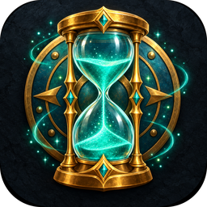
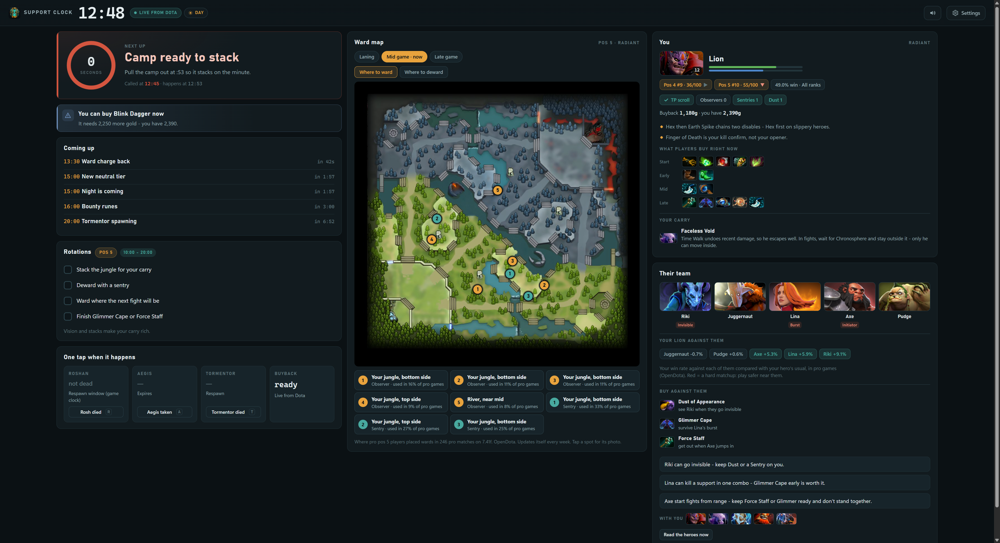
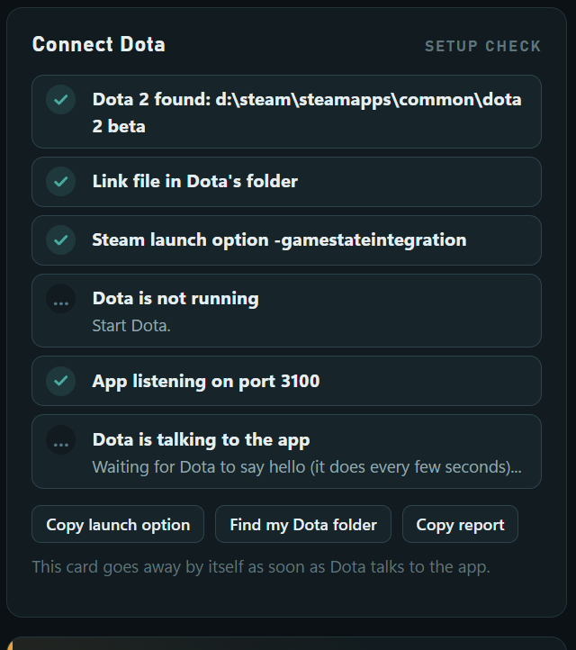
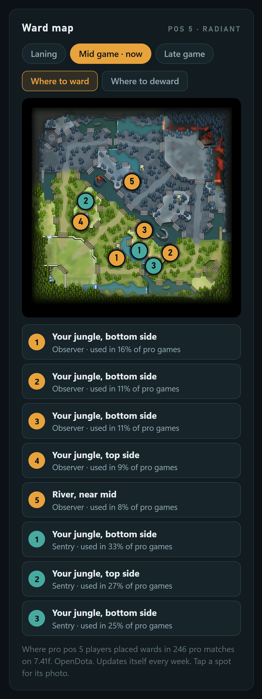
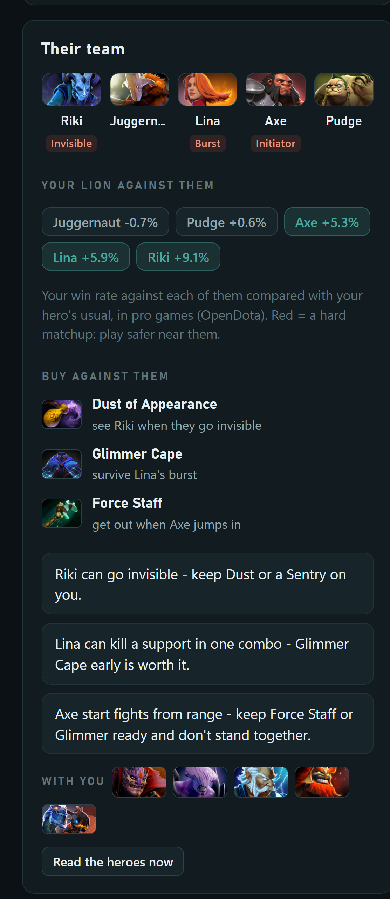

<h1 align="center">Support Clock</h1>

<b>A Dota 2 coach for pos 4 and pos 5 supports</b> - Windows 10/11

<a href="https://github.com/originroastery1-crypto/support-clock-app/releases/latest/download/Support-Clock.zip"><b>⬇ Download Support-Clock.zip</b></a>

It sits on your second monitor, follows Dota's game clock and tells you what to do next - runes, pulls, stacks, wards, Roshan, Tormentor, day and night - with a voice, so you don't have to look. Plus a ward and deward map from real pro games of this patch, your hero's tips and items, the enemy lineup read off the top bar, and a report card after each game.

## Install (2 minutes)

1. **Download [Support-Clock.zip](https://github.com/originroastery1-crypto/support-clock-app/releases/latest/download/Support-Clock.zip)** and unzip it (for example to your Desktop). Don't run it from inside the zip.
2. Open **SupportClock.exe**. If Windows says *"Windows protected your PC"*: **More info -> Run anyway**.
3. Press **Copy launch option** in the app, then in Steam: right-click **Dota 2 -> Properties -> Launch options** -> paste `-gamestateintegration`.
4. Close Dota completely and start it again. The app turns green: **Dota connected**.

Not connecting? The **Connect Dota** card in the app shows what's missing with a red line, and **Copy report** gives you a text to send for help.

## Updates

The app updates itself: when a new version is out, the top of the app shows **Update ready** - one click and it's done (never during a game).

## Safe for VAC

It uses Valve's own **Game State Integration** (the same feed Logitech keyboards and streaming overlays use) and an ordinary screenshot of the top bar (like OBS or Discord). It never reads or changes the game.

 

---
This repository only hosts the downloads. Every release lists what changed.
